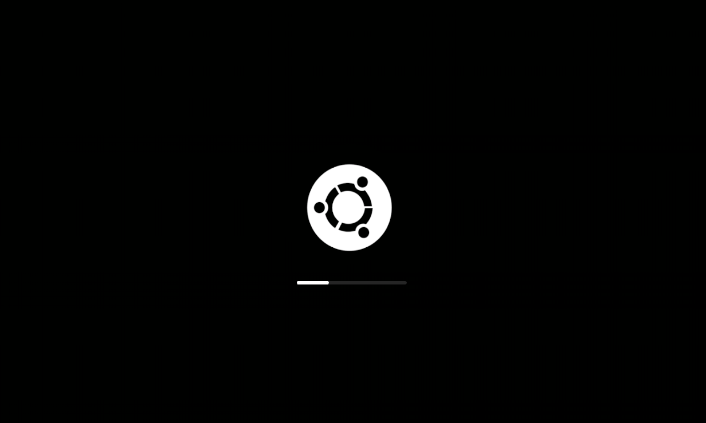

# dubb-plymount-installer
######Ubuntu Minimalize splash

##**How to installing**

> sudo chmod +x install.sh run_plymouth.sh
> ./install.sh
or
> bash install.sh

_finish_

### Live demo just running
> ./run_plymouth

